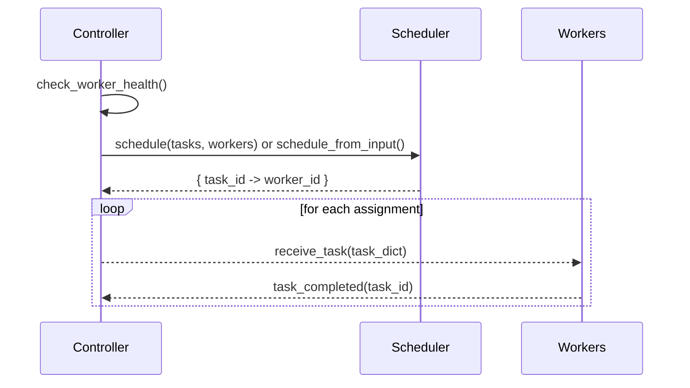
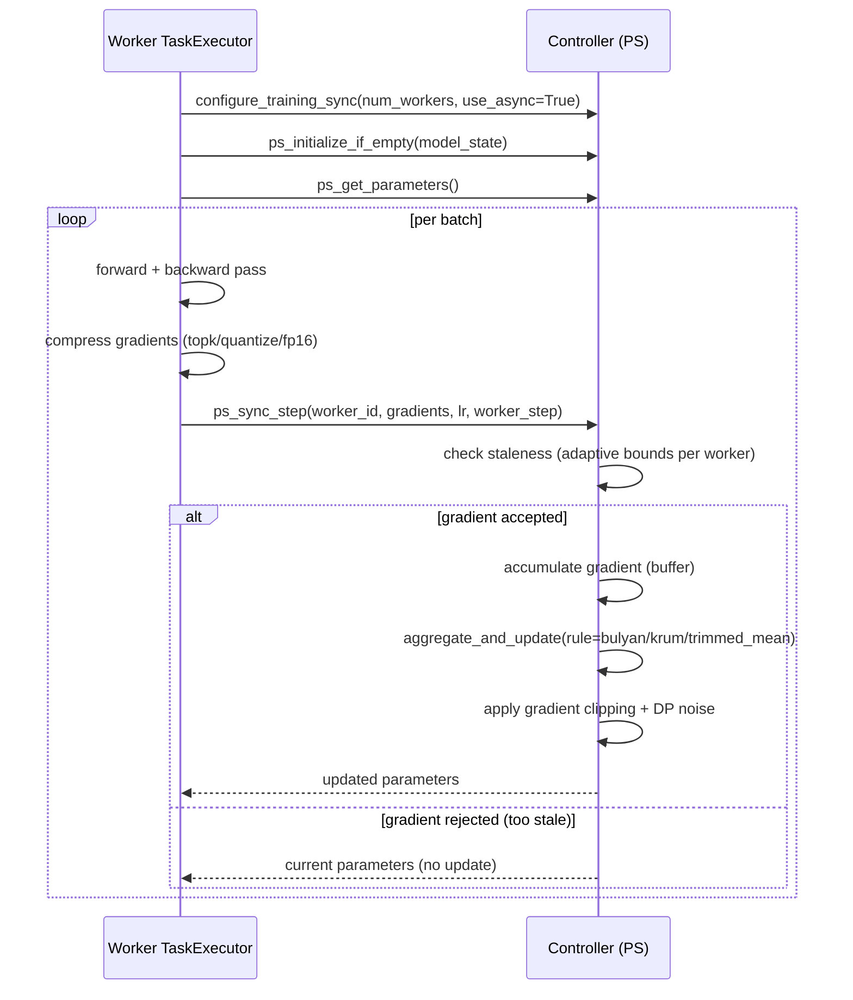

# System Architecture

This document describes the core components, their responsibilities, and how they interact during a typical run.

Components:

### Core Infrastructure
- **Controller** (MainController): registers workers, manages tasks, runs scheduling cycles, coordinates PS.
- **Worker nodes** (WorkerNode): receive tasks over RPC, execute training, report status/metrics/telemetry.
- **Schedulers**: decide task→worker mapping; can use structured inputs and telemetry (Gale-Shapley, Priority, Capability).

### Communication Layer
- **XML-RPC (RPCCommunicator)**: Control-plane communication for task assignment, heartbeats, status
- **ZeroMQ + MessagePack** (recommended): Binary-efficient gradient transfer, preserves compression benefits

### Training Coordination
- **ParameterServer**: Central gradient aggregation with multiple aggregation rules
- **BoundedAsyncCoordinator** (recommended): Async SGD with staleness bounds for heterogeneous/WAN environments
  - **Adaptive Staleness** (v2.0): Per-worker staleness bounds based on submission speed (100% gradient acceptance)
  - Tracks worker speeds and adjusts bounds dynamically
- **SimpleSyncCoordinator**: Traditional barrier-based sync (deprecated for WAN)

### Gradient Optimization
- **GradientCompressor**: Top-k sparsification, 8-bit quantization, FP16 half-precision (up to 100x compression)
- **Byzantine-Robust Aggregation** (v2.0): Trimmed mean, Krum, Bulyan for defense against malicious workers
- **Differential Privacy** (v2.0): Gradient clipping + optional Gaussian noise for privacy protection

### Persistence & Recovery
- **SQLite snapshots**: Controller status, workers, tasks, metrics, telemetry
- **PyTorch checkpoints**: Parameter server model state for fault recovery

High-level diagram:

```mermaid
graph TD;
  subgraph Controller
    C[MainController]\n- workers registry\n- tasks\n- scheduler\n- PS & Sync\n- telemetry EWMA
  end
  subgraph Workers
    W1[WorkerNode+TaskExecutor]
    W2[WorkerNode+TaskExecutor]
    WN[...]
  end
  C -- XML-RPC: receive_task/heartbeat --> W1
  C -- XML-RPC: receive_task/heartbeat --> W2
  W1 -- XML-RPC: task_completed/metrics/telemetry --> C
  W2 -- XML-RPC: task_completed/metrics/telemetry --> C
```

Scheduling cycle sequence:



Training and sync:


### Async Training Flow (v2.0)

**Worker-Side Operations:**
1. Compute gradients via forward/backward pass
2. Compress gradients using selected method (topk, quantize, fp16)
3. Submit to parameter server with worker step number
4. Receive updated parameters (or current if rejected)
5. Continue training without blocking

**Controller-Side Operations:**
1. **Staleness Check:** Compare `global_step - worker_step` against adaptive staleness bound
2. **Gradient Accumulation:** Buffer accepted gradients until accumulation size reached
3. **Byzantine-Robust Aggregation:** Apply Krum, Bulyan, or trimmed mean to filter malicious gradients
4. **Gradient Clipping:** Bound L2 norm for stability
5. **Differential Privacy:** Add Gaussian noise (optional)
6. **Model Update:** Apply aggregated gradients to global model
7. **Broadcast:** Send updated parameters to requesting worker

### Key Features

**Adaptive Staleness:**
- Fast workers: staleness_bound = max_staleness / 2.0 = 25
- Medium workers: staleness_bound = max_staleness / 1.0 = 50
- Slow workers: staleness_bound = max_staleness / 0.3 = 166
- Result: 100% gradient acceptance vs. 21-40% with fixed bounds

**Byzantine Defense:**
- Trimmed mean: Remove 30% extreme gradients (15% each side)
- Krum: Select k most representative gradients via pairwise distance
- Bulyan: Krum selection + trimmed mean (strongest defense)
- Formal tolerance: f < n/3 Byzantine workers

**Compression:**
- Top-k 1%: Keep only top 1% gradients by magnitude (100x compression)
- 8-bit quantization: Convert FP32→INT8 with min-max scaling (4x compression)
- FP16: Half-precision conversion (2x compression)
- ZMQ + MessagePack: Binary transfer preserves compression benefits

Persistence & resume:
- Controller emits snapshots of system status (workers, tasks, metrics, telemetry) to a SQLite DB.
- ParameterServer supports save/load to a torch checkpoint.
- The `resume` CLI reconstructs a controller, optionally loads PS checkpoint, and requeues non-completed tasks.

---

## System Capabilities (v2.0)

**Production-Ready Features:**
- ✅ Bounded-staleness async SGD with adaptive per-worker bounds
- ✅ Gradient compression (top-k, quantize, fp16)
- ✅ Byzantine-robust aggregation (trimmed mean, Krum, Bulyan)
- ✅ Differential privacy (gradient clipping + noise)
- ✅ Binary communication (ZMQ + MessagePack)
- ✅ Comprehensive testing (64+ tests, 100% pass rate)

**Performance Characteristics:**
- Bandwidth: 500 GB → 4 GB per worker (132x reduction with top-k 1%)
- Gradient acceptance: 100% with adaptive staleness
- Byzantine tolerance: Up to 33% malicious workers (f < n/3)
- Convergence: 10-25% degradation with all features enabled

**See also:**
- `docs/training_protocol.md` - Detailed protocol documentation
- `docs/async_training_and_compression.md` - Technical deep dive
- `BYZANTINE_DEFENSE.md` - Byzantine attack defense
- `ADAPTIVE_STALENESS.md` - Adaptive staleness design
