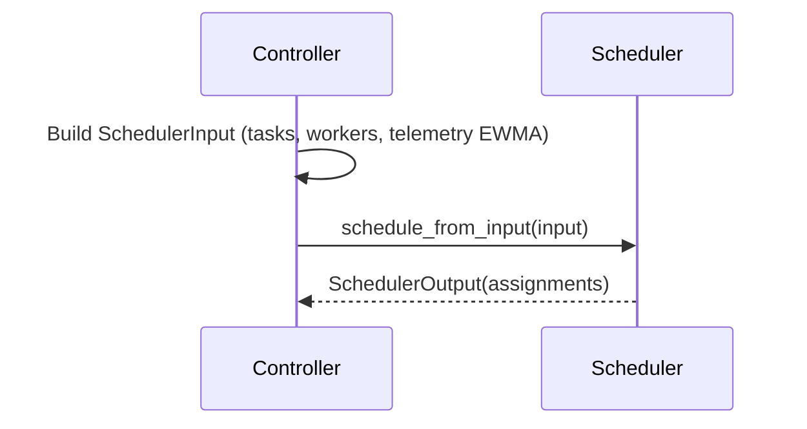

# Scheduler Design

Goals:
- Support multiple algorithms with a unified interface.
- Allow schedulers to consume rich inputs: task/worker features + telemetry.
- Preserve legacy compatibility.

Interfaces:
- Legacy: `schedule() -> Dict[str, str]` mapping task_id -> worker_id.
- Structured (preferred): `schedule_from_input(SchedulerInput) -> SchedulerOutput`.
- Structured types: see `dist_llm_train/scheduler/interfaces.py`.

Implemented schedulers:
- Gale–Shapley (stable matching): legacy API; tasks propose to workers; produces a stable matching when both sides have preferences.
- Priority: structured API; greedy assignment by descending task priority with memory fit.
- Capability: structured API; greedy assignment using a score combining FLOPS, bandwidth, memory headroom, and telemetry EWMA tokens/sec.

Capability scoring (simplified):

```
score(worker, task) =
  1.0 * flops_per_second +
  0.1 * network_bandwidth +
  0.01 * max(0, memory - task.total_memory) +
  0.01 * (avg_tokens_per_sec if present else tokens_per_sec if present else 0)
```

Structured scheduler flow:



Extending schedulers:
- Implement `SUPPORTS_STRUCTURED_INPUT = True` and `schedule_from_input`.
- Consume `SchedulerInput.workers[i].telemetry` for bandwidth/throughput-aware policies.
- Support fairness: use `job_id`/`job_weight` to enforce weighted quotas.
